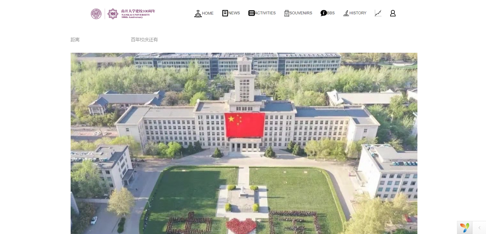
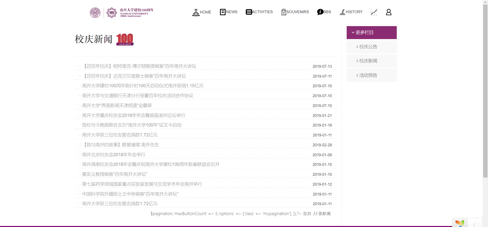
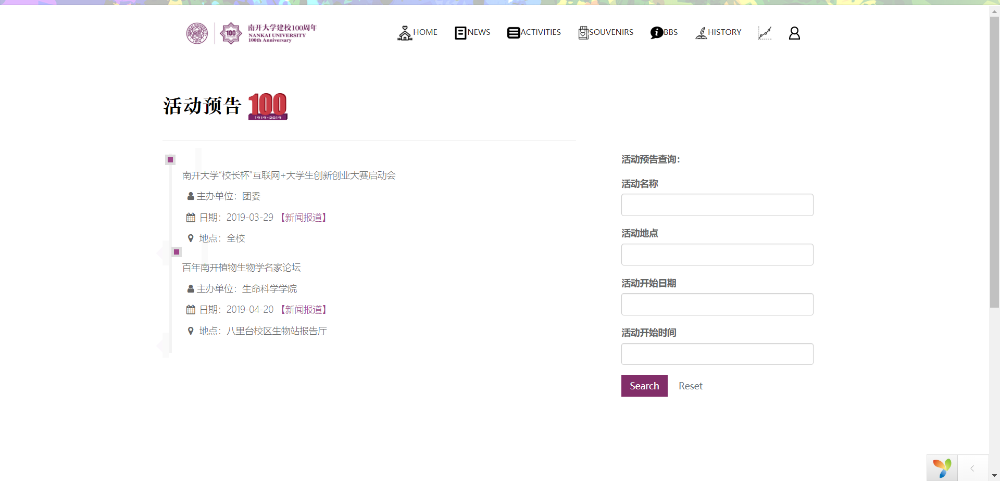
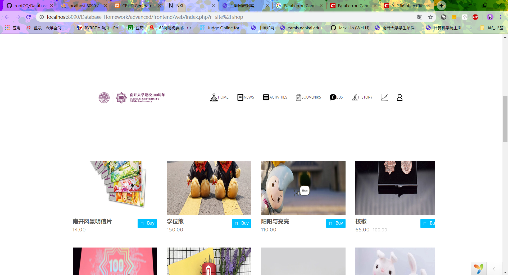
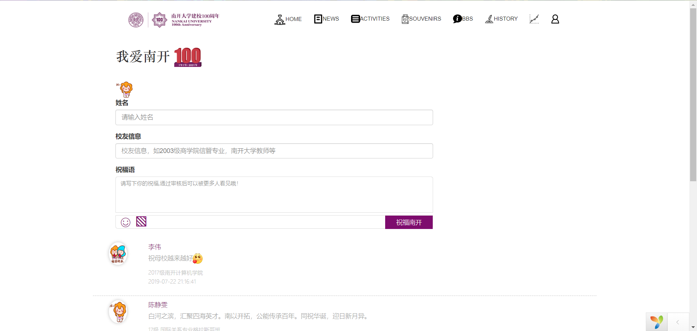
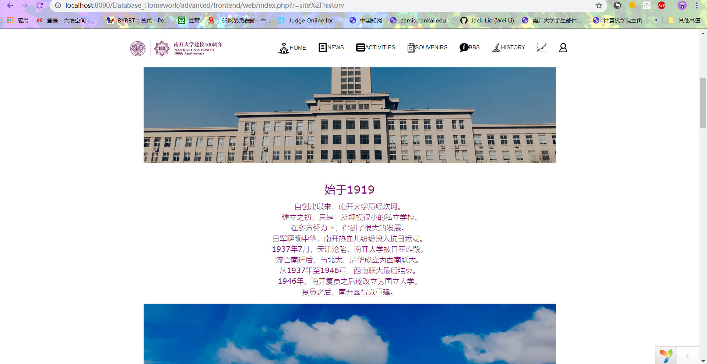
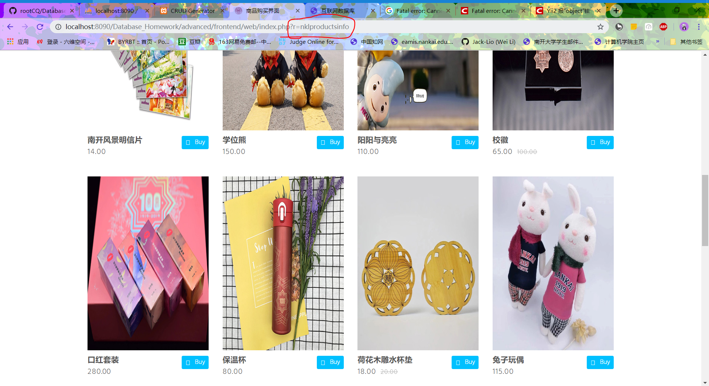
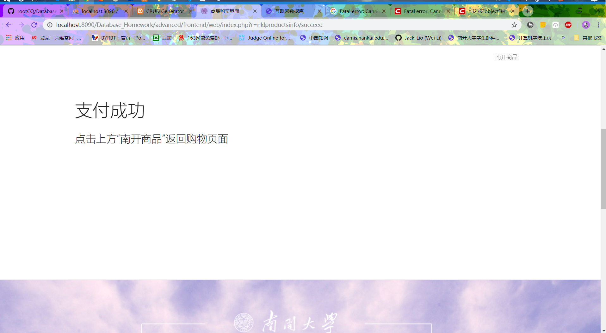
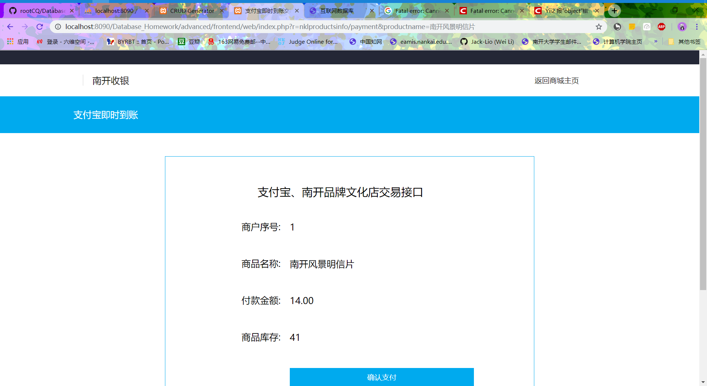
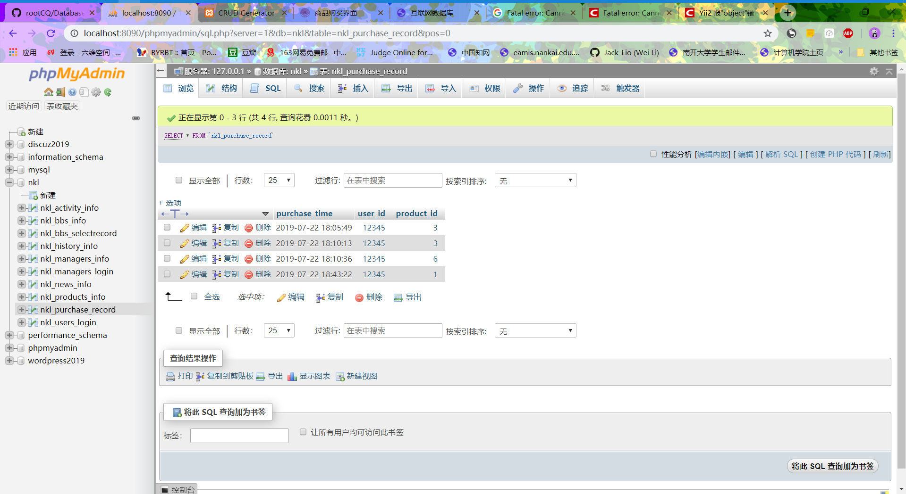

#  互联网数据库开发

>  [应该没有bug的前台](http://49.234.202.251/advanced/frontend/web/index.php)
>  [应该没有bug的后台](http://49.234.202.251/advanced/backend/web/index.php)

## 模板整合到本地

#### 已更改，直接pull origin master或者clone即可本地运行

1. 将statics文件夹一整个复制粘贴到/advanced/frontend/web/中
2. 将AppAsset.php复制粘贴到/advanced/frontend/assets/中替换原文件(建议原文件先备份以免无法恢复)
3. main.php复制粘贴到/advanced/frontend/views/layouts/中替换原文件(建议原文件先备份以免无法恢复)

## Github使用

上传的PDF教程相比廖雪峰教程更简洁易懂一些，快速入门

> 教程里面有github alias的用法，可以快捷键操作git

总结了下最常用的命令：

- 更新本地仓库
  - 初次使用整个clone：git clone https://github.com/rootCQ/Database_Homework.git
  - 后面直接 git pull origin master
- git checkout -b dev 创建并转到分支dev
- git status 查看状态新替换的文件变绿才能push，
  - 如果是红色，使用git add <文件名>
- git diff 比较文件、分支、提交之间的差异
- git push origin master直接提交到master分支(懒)

## 模板怎么导入

1. 首先对模板的index.HTML文件进行分析，抽取所有的css路径以及js路径，以及一些在文件内部定义的script定义
2. 将css文件路径以及js文件路径，在appset.php 文件中声明
3. 修改layout文件，将给文件化的script定义以及需要挪用的HTML框架代码替换掉body模块
4. 将css和js 文件按照路径进行部署
5. 试运行，如果页面存在问题，可以通过F12进入检查页面，通过network查看资源请求和成功情况，对红色的404 错误分析是否路径问题，对路径进行调整，目前有些代码可能是动态页面，这一块我也不太清楚，不知道怎么改。

## 上传文件使用说明

- 上传的模板导入demo启动问题，注意一下数据库的配置，在mani_local .php 中进行配置，前台的模板是我自己找的，后台是上课老师演示的。			—— 李伟  0712

## 分支管理说明

- 在git push代码的时候尽量先push到Dev（开发分支上）之后在合并到master分支，方便管理代码和版本控制。

- 在本地创建代码仓库的时候先clone远程仓库，并在本地修改正确之后再推送到远程仓库

- [本地上传到远程分支的方法](https://blog.csdn.net/csj731742019/article/details/82773581)

- [git创建远程分支和本地分支](https://blog.csdn.net/csj731742019/article/details/82773581)

- [廖雪峰git教程](https://www.liaoxuefeng.com/wiki/896043488029600/900003767775424)

## 0722 李伟版  修改说明
最新版修改内容包括以下内容：
- 整合李力铤历史页面，该页面目前为从数据库获取数据显示的版本
- 整合朱心怡销售页面，目前由于朱心怡的销售页面设计逻辑和当前的项目设计逻辑有所不同，所以还没有完全整合进入整体项目中去，zxy设计销售页面的逻辑首先是利用自己写的product.PHP文件进行数据库连接的配置，然后采用编写的NklProductsInfoController.php进行跳转的控制，因此她所编写的三个文件（分别销售主页页面（index)、确认付款页面(payment )、支付成功页面（succeed))均在views下属的文件夹nklproductsinfo下，我对涉及的相关的js和css以及img都做了归档存放的处理，目前手动访问{http://...index.php?r=nklproductsinfo} 可以进入index界面（商品页面）并可以点击购买将数据传入数据库，但是目前没有登录验证的功能，即用户没有登录也可以购买商品，需要后期完善，此外朱心怡的登录页面没有整合
- 对活动预告页面和留言页面的部分样式进行了完善，具体可以看截图效果

***对于代码有什么问题或者想看一下具体的代码逻辑，可以找李力挺要完整的代码，zxy的代码也将一起打包发给李力铤，上述图片保存在picture-lw文件夹中***

